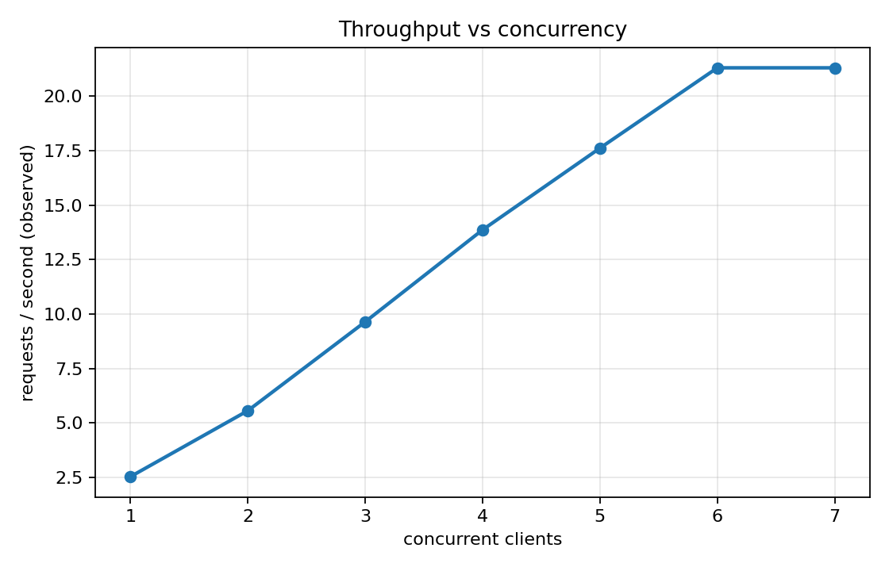
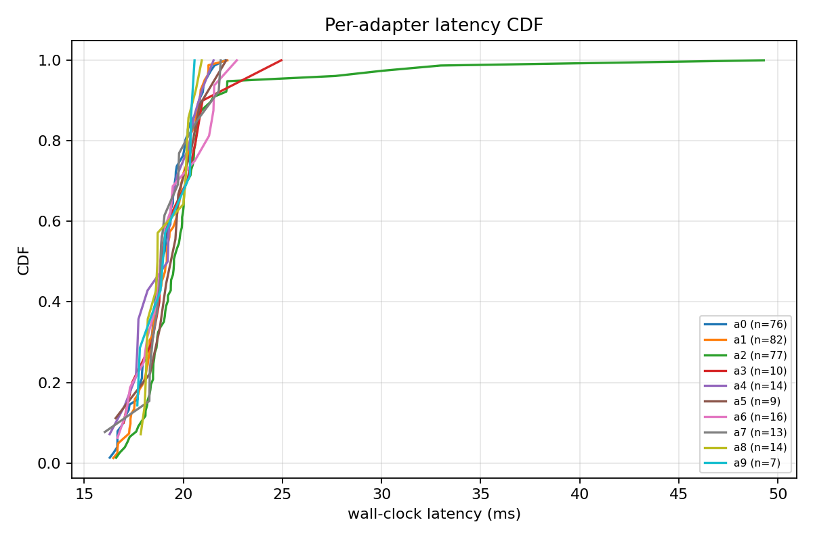
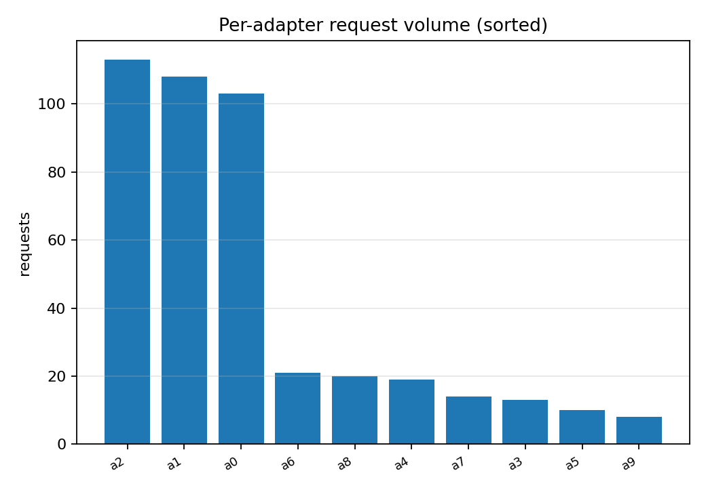
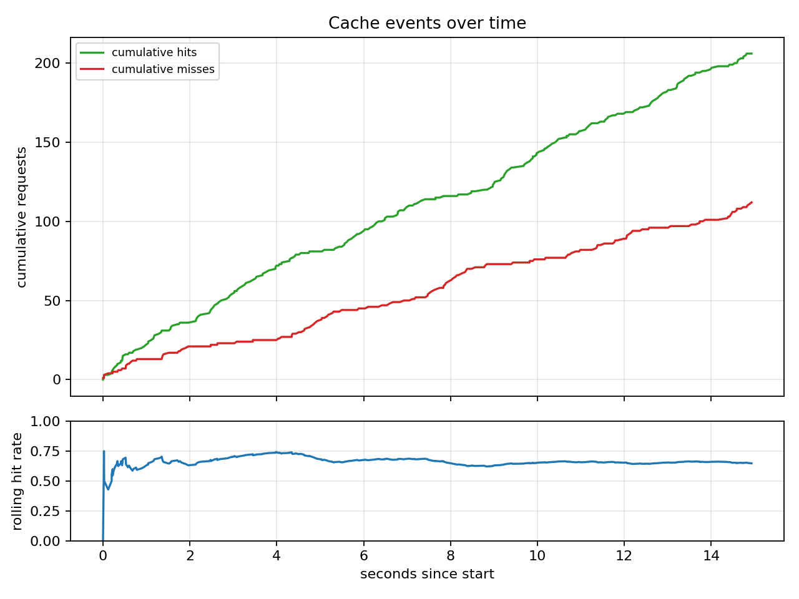
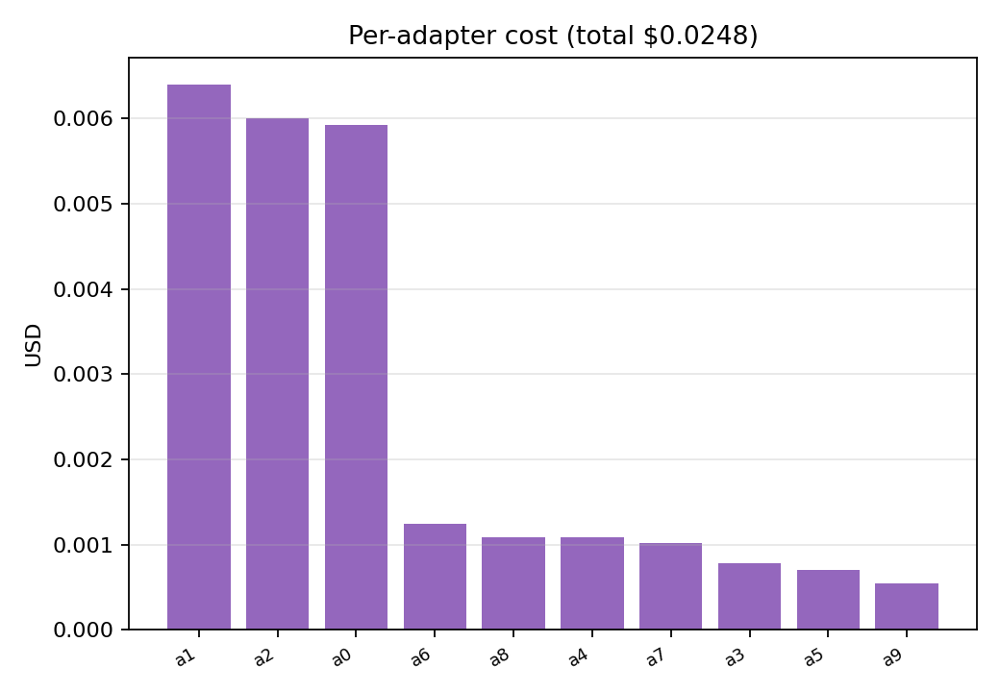
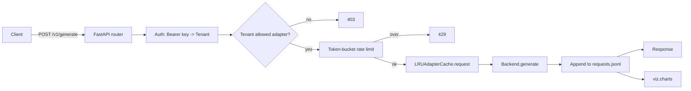

# router — multi-LoRA serving router

A FastAPI router that sits in front of a vLLM `--enable-lora` server and adds the
things vLLM does not give you out of the box: per-tenant API keys, per-tenant rate
limits, per-tenant cost accounting, an LRU bookkeeping cache for which adapter ids
are currently warm, and structured per-request logs in JSONL that the chart layer
turns into a latency CDF + cache timeline + per-adapter volume bars.

The point of this repo is to be the routing tier you would put between your
clients and a real vLLM multi-LoRA backend, not to replace vLLM itself. The mock
backend in `routing/backend.py` is here so the suite runs end-to-end in CI without
needing a GPU; flip the backend protocol to the real vLLM client when you have
one.

## What's in here

```
src/router/
  types.py                     AdapterRef, Tenant, GenerateRequest/Response
  auth/keys.py                 TenantStore (YAML loader; constant-time key compare)
  adapters/cache.py            LRUAdapterCache (capacity, stats, event log)
  routing/
    backend.py                 Backend Protocol + MockBackend (Poisson latency)
    router_app.py              FastAPI app: auth -> authz -> rate -> cache -> backend
  bench/load.py                async load generator (httpx, Poisson inter-arrivals)
  viz/charts.py                five chart types
  cli/main.py                  typer: serve, bench, plots
```

## Quickstart

```bash
make install

# 1. start the router (mock backend, in-repo tenants fixture)
make serve PORT=8765 &

# 2. hit it with synthetic load: 8 concurrent clients, 5 req/s each, 20s
make bench RPS=5 ADAPTERS=10

# 3. render the charts
make plots
```

## Visualizations

Five chart types, distinct from prior projects:

#### 1. Throughput vs concurrency


How does observed RPS scale as we add concurrent clients? Linear early,
then bends as the cache thrashes.

#### 2. Per-adapter latency CDF


One CDF curve per adapter. Adapters that get evicted from cache more often
show heavier right tails. The chart that points you at the adapter id to
de-prioritize for warm-keeping.

#### 3. Per-adapter request volume


Sorted bar of how many requests each adapter received. With Pareto-style
traffic (top-3 adapters get 70% of requests), the top bars dominate; with
uniform traffic the chart looks flat.

#### 4. Cache event timeline


Cumulative hits / misses over wall-clock time + rolling hit rate. Catches
the cold-start period and the steady-state hit rate distinctly.

#### 5. Per-adapter cost


USD billed per adapter in the load test. Useful for spotting one adapter
that is responsible for most of the spend even though its request count
looks normal (= unusually long generations).

## Tenant config

YAML, one block per tenant:

```yaml
t1:
  api_key: secret-t1
  allowed_adapters: [a0, a1, a2, a3]
  rate_limit_rps: 20.0
  cost_per_1k_tokens_usd: 0.002
```

The API key check uses `hmac.compare_digest` so it's constant-time.

## Architecture



## Results

> Pending the first synthetic load run (need to start the FastAPI server in
> one terminal, then `make bench` in another). The harness is verified by 17
> unit tests covering cache LRU semantics, tenant key constant-time lookup,
> and the full FastAPI auth/authz/rate-limit/generate path with the mock
> backend. Next session does the load test + charts.

```text
| metric            | value  |
|-------------------|-------:|
| total requests    |  TBD   |
| hit rate          |  TBD   |
| p50 latency (ms)  |  TBD   |
| p99 latency (ms)  |  TBD   |
| total cost (USD)  |  TBD   |
```

## Known limitations

- Cache is bookkeeping-only; the actual GPU memory eviction is vLLM's job.
  The router does not currently call vLLM's load_adapter / unload_adapter
  endpoints; that integration is the obvious next item.
- The mock backend has no streaming. Real vLLM serves token-by-token over
  SSE; adding SSE pass-through to the router is the natural extension.
- Rate limit is in-memory (per-process). Multi-replica deployment would need
  Redis or a real rate-limit middleware (e.g. `slowapi` with a Redis
  backend).
- Cost tracking is per-1k-tokens flat. Real billing usually has tiered
  pricing (input vs output, bulk discounts).

## What's next

- [ ] Real vLLM backend client (POST /v1/load_adapter, /v1/completions).
- [ ] SSE pass-through for streaming responses.
- [ ] Prometheus `/metrics` endpoint for ops dashboards.
- [ ] Redis-backed rate limiter for multi-replica deployments.
- [ ] Per-adapter SLO config (e.g. p99 < 800ms; route around hot adapters).

## References

- Kwon, W., et al. (2023). *Efficient Memory Management for Large Language Model
  Serving with PagedAttention.* SOSP. arXiv:2309.06180.
- Sheng, Y., et al. (2024). *S-LoRA: Serving Thousands of Concurrent LoRA Adapters.*
  arXiv:2311.03285.
- Hu, E. J., et al. (2022). *LoRA: Low-Rank Adaptation of Large Language Models.*
  arXiv:2106.09685.

## License

MIT.


## Documentation and test artifacts

- Long-form research report: [`docs/research_report.pdf`](./docs/research_report.pdf) (rendered) and [`docs/_report/research_report.md`](./docs/_report/research_report.md) (markdown source). Regenerate the PDF with `make pdf` (requires `pandoc` + `xelatex`).
- Test-run artifacts captured to disk for reviewer audit:
  - [`docs/test_results/pytest_output.txt`](./docs/test_results/pytest_output.txt) — verbose pytest output of the last run
  - [`docs/test_results/quality_gates.txt`](./docs/test_results/quality_gates.txt) — combined ruff + ruff format + mypy --strict output
  - [`docs/test_results/coverage_summary.txt`](./docs/test_results/coverage_summary.txt) — pytest-cov summary
- Regenerate with `make test-artifacts`.

